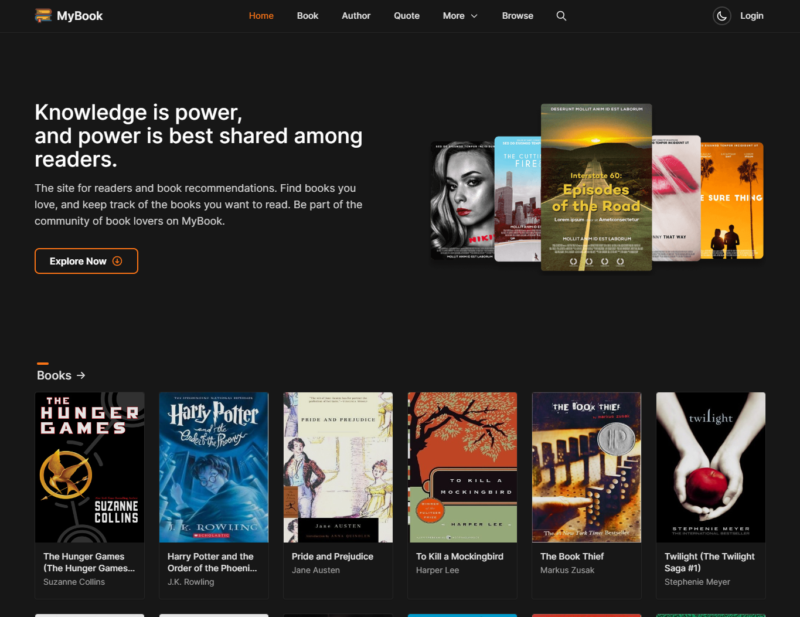
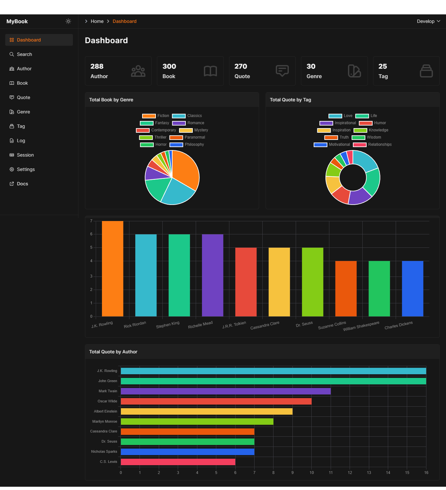

import { Card, Cards } from "@components/cards";
import {
	BookOpenIcon,
	ChatBubbleBottomCenterTextIcon,
	RectangleStackIcon,
  UserGroupIcon,
  ChartPieIcon,
  MagnifyingGlassIcon,
  ArrowRightOnRectangleIcon,
  ArrowLeftOnRectangleIcon,
	FilmIcon,
	UsersIcon,
	BuildingLibraryIcon,
	FlagIcon,
	SwatchIcon,
	Squares2X2Icon,
	RssIcon
} from "@heroicons/react/24/outline";

# Introduction
 
Welcome to MyBook REST API documentation. From here you can easily discover all available REST APIs with the required information on how to consume it.

## What is MyBook?

MyBook is a digital information and statistics about books, authors as well as quotes, genres and other book industry professionals. 

Our searchable database includes hundreds of books, authors and others.

## Database

Import data directly from a CSV or excel spreadsheet to **Supabase**.

[CSV](https://github.com/wahid-ari/next-supabase-book-docs/tree/master/public/supabase-csv)

## Postman

You can import collections or your API specifications directly into Postman.

Export Collection v2.1 > [JSON](/Next-Supabase-Book.postman_collection.json)

Export Collection v2.1 > [JSON](https://github.com/wahid-ari/next-supabase-book-docs/blob/master/public/Next-Supabase-Book.postman_collection.json) (github)

Export Collection v2.1 > [JSON](https://github.com/wahid-ari/next-supabase-book-docs/raw/master/public/Next-Supabase-Book.postman_collection.json) (download)

## Documentation

Discover our REST API documentation

<Cards>
	<Card
		icon={
			<ArrowRightOnRectangleIcon className="w-6 h-6" />
		}
		title="Login"
		href="/login"
	/>
	<Card
		icon={
			<ArrowLeftOnRectangleIcon className="w-6 h-6" />
		}
		title="Logout"
		href="/logout"
	/>
	<Card
		icon={
			<MagnifyingGlassIcon className="w-6 h-6" />
		}
		title="Search"
		href="/search"
	/>
	<Card
		icon={
			<ChartPieIcon className="w-6 h-6" />
		}
		title="Statistics"
		href="/statistics"
	/>
	<Card
		icon={
			<UserGroupIcon className="w-6 h-6" />
		}
		title="Author"
		href="/author"
	/>
	<Card
		icon={
			<BookOpenIcon className="w-6 h-6" />
		}
		title="Book"
		href="/book"
	/>
	<Card
		icon={
			<ChatBubbleBottomCenterTextIcon className="w-6 h-6" />
		}
		title="Quote"
		href="/quote"
	/>
	<Card
		icon={
			<SwatchIcon className="w-6 h-6" />
		}
		title="Genre"
		href="/genre"
	/>
	<Card
		icon={
			<RectangleStackIcon className="w-6 h-6" />
		}
		title="Tag"
		href="/tag"
	/>
	<Card
		icon={
			<Squares2X2Icon className="w-6 h-6" />
		}
		title="Dashboard"
		href="/dashboard"
	/>
	<Card
		icon={
			<RssIcon className="w-6 h-6" />
		}
		title="Sitemap"
		href="/sitemap"
	/>
</Cards>